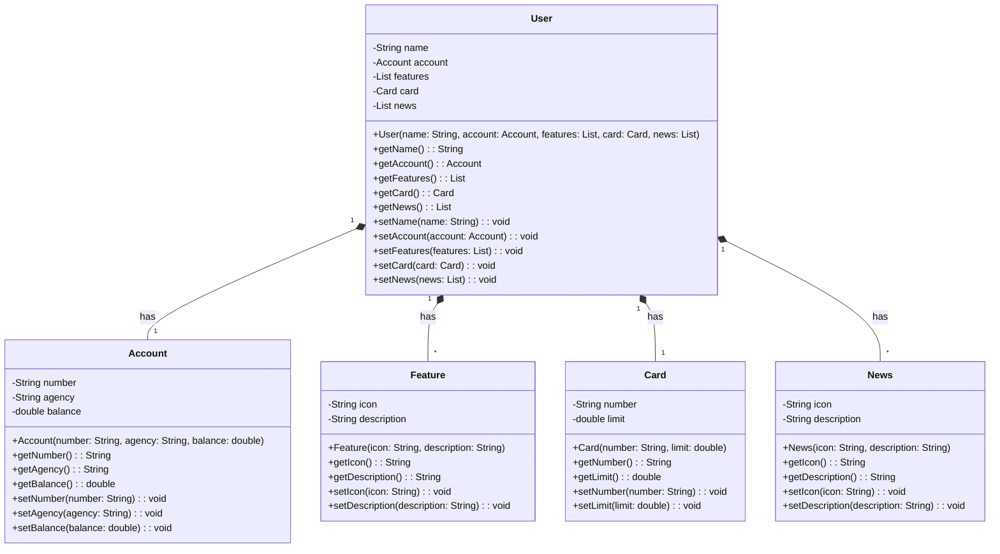

Bootcamp Santander Dev Weem 2024.
Java RestFul API

```mermaid

classDiagram
    class User {
        -String name
        -Account account
        -List<Feature> features
        -Card card
        -List<News> news
        +User(name: String, account: Account, features: List<Feature>, card: Card, news: List<News>)
        +getName(): String
        +getAccount(): Account
        +getFeatures(): List<Feature>
        +getCard(): Card
        +getNews(): List<News>
        +setName(name: String): void
        +setAccount(account: Account): void
        +setFeatures(features: List<Feature>): void
        +setCard(card: Card): void
        +setNews(news: List<News>): void
    }

    class Account {
        -String number
        -String agency
        -double balance
        +Account(number: String, agency: String, balance: double)
        +getNumber(): String
        +getAgency(): String
        +getBalance(): double
        +setNumber(number: String): void
        +setAgency(agency: String): void
        +setBalance(balance: double): void
    }

    class Feature {
        -String icon
        -String description
        +Feature(icon: String, description: String)
        +getIcon(): String
        +getDescription(): String
        +setIcon(icon: String): void
        +setDescription(description: String): void
    }

    class Card {
        -String number
        -double limit
        +Card(number: String, limit: double)
        +getNumber(): String
        +getLimit(): double
        +setNumber(number: String): void
        +setLimit(limit: double): void
    }

    class News {
        -String icon
        -String description
        +News(icon: String, description: String)
        +getIcon(): String
        +getDescription(): String
        +setIcon(icon: String): void
        +setDescription(description: String): void
    }

    User "1" *-- "1" Account : has
    User "1" *-- "*" Feature : has
    User "1" *-- "1" Card : has
    User "1" *-- "*" News : has


```
